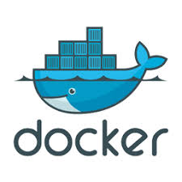
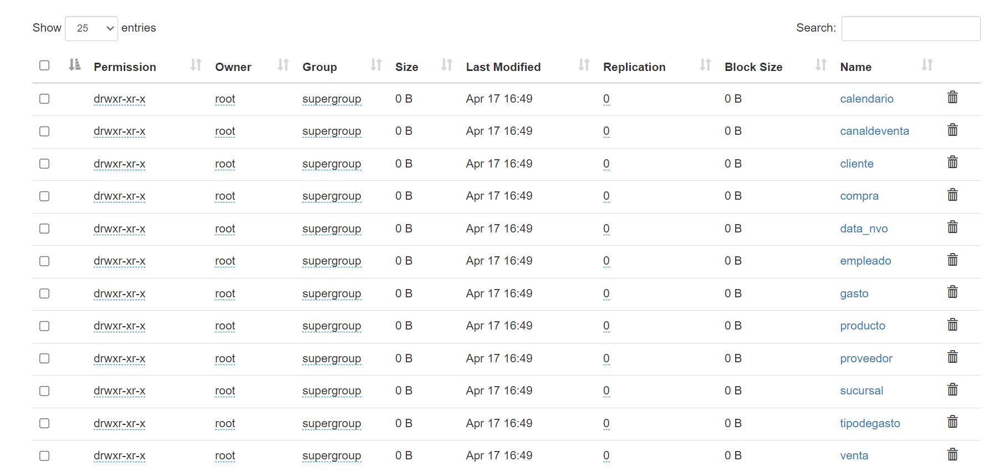

# Practica Integradora de herramientas de Big Data

Durante esta practica la idea es emular un ambiente de trabajo, desde un área de innovación solicitan construir un MVP(Producto viable mínimo) de un ambiente de Big Data donde se deban cargar unos archivos CSV que anteriormente se utilizaban en un datawarehouse en MySQl, pero ahora en un entorno de Hadoop.

Desde la gerencia de Infraestructura no están muy convencidos de utilizar esta tecnología por lo que no se asigno presupuesto alguna para esta iniciativa, de forma tal que por el momento no es posible utilizar un Vendor(Azure, AWS, Google) para implementar dicho entorno, es por esto que todo el MVP se deberá implementar utilizando Docker de forma tal que se pueda hacer una demo al sector de infraestructura mostrando las ventajas de utilizar tecnologías de Big Data.

# Entorno Docker con Hadoop, Spark y Hive
        

Se pesenta un entorno Docker con Hadoop (HDFS) y la implementación de:
* Spark
* Hive 
* HBase
* MongoDB
* Neo4J
* Zeppelin
* Kafka


Es importante mencionar que el entorno completo consume muchos recursos de su equipo, motivo por el cuál, se propondrán ejercicios pero con ambientes reducidos, en función de las herramientas utilizadas.

### Nota: Este proyecto fue desarrollado en Windows, por lo que se generó una máquina virtual en VirtualBox con Ubuntu (Docker no es compatible con Windows) en la que se instaló Docker y se utilizó PuTTY para conectar la máquina virtual con la original con Windows. Tambien se puede utilizar WinSCP para facilitar el manejo de archivos en Ubuntu. Los links se proveen a continuacion

>VirtualBox: https://www.virtualbox.org/wiki/Downloads
>
>PuTTY: https://www.putty.org/
>
>WinSCP: https://winscp.net/eng/download.php

Ejecute `docker network inspect` en la red (por ejemplo, `docker-hadoop-spark-hive_default`) para encontrar la IP en la que se publican las interfaces de hadoop. Acceda a estas interfaces con las siguientes URL:

```
Namenode: http://<IP_Anfitrion>:9870/dfshealth.html#tab-overview
Datanode: http://<IP_Anfitrion>:9864/
Spark master: http://<IP_Anfitrion>:8080/
Spark worker: http://<IP_Anfitrion>:8081/	
HBase Master-Status: http://<IP_Anfitrion>:16010
HBase Zookeeper_Dump: http://<IP_Anfitrion>:16010/zk.jsp
HBase Region_Server: http://<IP_Anfitrion>:16030
Zeppelin: http://<IP_Anfitrion>:8888
Neo4j: http://<IP_Anfitrion>:7474
```

Para implementar ejecute

	git clone https://github.com/javyleonhart/Practica_herramientasBigData.git

Una vez descargadas las herramientas que utilizaremos, entraremos al carpeta con el comando "cd"

	cd Practica_herramientasBigData

Con el siguiente levantaremos el contenedor correspondiente a la tarea que ejecutaremos

	sudo docker-compose -f docker-compose-vX.yml up -d

Reemplazar la X con el numero deseado

## 1) HDFS

Se puede utilizar el entorno docker-compose-v1.yml

	sudo docker-compose -f docker-compose-v1.yml up -d

Una vez creado el contendor, entraremos al namenode(contenedor) 

	sudo docker exec -it namenode bash
 .
 
	cd home
 
Crearemos el directorio Datasets con el comando mkdir

	mkdir Datasets

Dentro de Datasets

	cd Datasets

 crearemos una carpeta para cada csv que vamos a exportar con mkdir.
 
 	mkdir calendario
	mkdir canaldeventa
	mkdir cliente
	mkdir compra
	mkdir data_nvo
	mkdir empleado
	mkdir gasto
	mkdir producto
	mkdir proveedor
	mkdir sucursal
	mkdir tipodegasto
	mkdir venta
 
 Para esto se provee el archivo Paso00.sh, el cual hay que mover dentro de la carpeta donde se quiere utilizar, en este caso Datasets, con el siguiente comando

 	sudo docker cp <path><archivo> namenode:/home/Datasets/

Luego, salimos

	exit

Y copiaremos los archivos ubicados en la carpeta Datasets, dentro del contenedor "namenode"

	sudo docker cp <path><archivo> namenode:/home/Datasets/<archivo>

Se puede ejecutar el archivo "Paso01" provisto en los materiales para mover todos los archivos. Para usarlo, primero hay que darle permisos con chmod

	chmod u+x Paso01.sh

luego ejecutarlo

	./Paso01.sh


Ubicarse en el contenedor "namenode"


	sudo docker exec -it namenode bash


Crear un directorio en HDFS llamado "/data".


	hdfs dfs -mkdir -p /data


Copiar los archivos csv provistos a HDFS:

	hdfs dfs -put /home/Datasets/* /data


Para verificar si se ejecuto correctamente podemos entrar al hdfs namenoda mediante

	http://<IP_Anfitrion>:9870/dfshealth.html#tab-overview

En utilities/Browse the file system debe estar la carpeta data con los archivos




### Nota: Se recomienda guardar los csv en su respectiva carpeta y no todos juntos porque al usar Hive, se puede poblar una tabla con todos los csv en determinada carpeta. Por ejemplo, si tengo 2 o mas archivos de 'compra', al crear la tabla, con el comando LOCATION se pueden cargar a la tabla todos los csv presentes en dicha carpeta en vez de uno por uno con el LOAD DATA INPATH.

## 2) Hive

Para este paso se puede utilizar el entorno docker-compose-v2.yml

	sudo docker-compose -f docker-compose-v2.yml up -d

Con el comando anterior creamos un entorno con Hive

Crearemos tablas en Hive, a partir de los csv ingestados en HDFS.

Para esto, se puede ubicar dentro del contenedor correspondiente al servidor de Hive, y ejecutar desdea allí los scripts necesarios

	sudo docker exec -it hive-server bash

Una vez dentro, con el siguiente comando ejecutamos hive

	hive

Aqui dentro podremos crear las tablas, poblarlas y consultarlas con comandos SQL


Este proceso de creación y población las tablas debe poder ejecutarse desde Paso02.hql

Nota: Para ejecutar un script de Hive, requiere el comando:

	hive -f <script.hql>

Este script hay que ejecutarlo desde dentro del entorno de hive, para ello, desde la carpeta donde están los archivos

	sudo docker cp ./Paso02.hql hive-server:/opt/

Para ver si se cargo correctamente, podemos entrar a Hive y consultar la base de datos


## 3) Formatos de Almacenamiento

Las tablas creadas en el punto 2 a partir de archivos en formato csv, deben ser almacenadas en formato Parquet + Snappy.
Tener en cuenta además de aplicar particiones para alguna de las tablas. Para ello vamos a crear una segunda DB donde poblaremos las tablas a partir de las tablas de la primera DB. Primero agregamos unos comandos al CREATE TABLE

>STORED AS PARQUET - Con esta linea guardamos la informacion que cargamos en la tabla como .Parquet
>TBLPROPERTIES ('parquet.compression'='SNAPPY') - Con esta linea comprimimos el .parquet en formato Snappy

Al poblar las tablas con INSERT INTO, para que tome la informacion de la primera DB escribiremos, luego de los campos:

>FROM 'db1'.'tabla'

Si queremos particionar la tabla, al crearla agregamos

> PARTITIONED BY('columna' 'tipo de dato')

Si queremos insertar la data particionada, en el INSERT agregamos

> PARTITION('IdTipoGasto'<- columna '=1' <- condicion))

Se proporciona en los materiales el script Paso03.hql que corre dicho ejercicio y hace unos ejercicios de particion. Recordar de pasar el archivo dentro del contenedor de Hive para poder ejecutarlo

Si consultamos por la tabla gasto, verificamos que la tabla esta organizada por el IdTipoGasto que tomo de la primera DB


## 4) SQL

La mejora en la velocidad de consulta que puede proporcionar un índice tiene el costo del procesamiento adicional para crear el índice y el espacio en disco para almacenar las referencias del índice.
Se recomienda que los índices se basen en las columnas que utiliza en las condiciones de filtrado. El índice en la tabla puede degradar su rendimiento en caso de que no los esté utilizando.
Crear índices en alguna de las tablas cargadas y probar los resultados:

```
CREATE INDEX index_name
 ON TABLE base_table_name (col_name, ...)
 AS index_type
 [WITH DEFERRED REBUILD]
 [IDXPROPERTIES (property_name=property_value, ...)]
 [IN TABLE index_table_name]
 [ [ ROW FORMAT ...] STORED AS ...
 | STORED BY ... ]
 [LOCATION hdfs_path]
 [TBLPROPERTIES (...)]
 [COMMENT "index comment"];
```

Ejemplo:

```
hive> CREATE INDEX index_students ON TABLE students(id) 
 > AS 'org.apache.hadoop.hive.ql.index.compact.CompactIndexHandler' 
 > WITH DEFERRED REBUILD ;
```
Para cambiar el índice, podemos usar el siguiente comando 

>ALTER INDEX index_name ON table_name [PARTITION partition_spec] REBUILD;

Ejemplo:
```
hive> ALTER INDEX index_students ON students(idCohort) REBUILD; 
```
Para eliminar el índice

>DROP INDEX [IF EXISTS] index_name ON table_name;
```
hive> DROP INDEX IF EXISTS index_students ON students; 
```

A modo de ejemplo, trabajaremos en la BD integrador2 y realizaremos una consulta:

Primero entramos a la BD

	USE integrador2;

Luego realizamo la siguiente consulta y revisaremos el tiempo

	SELECT idsucursal, SUM(precio * cantidad) FROM venta GROUP BY idsucursal;


Luego crearemos un índice con el siguien comando

	CREATE INDEX index_venta_sucursal ON TABLE venta(IdSucursal) AS 'org.apache.hadoop.hive.ql.index.compact.CompactIndexHandler' WITH DEFERRED REBUILD;

Y realizaremos la misma consulta para ver cuanto tiempo tarda


Como podemos observar, la misma consulta redujo considerablemente el tiempo de ejecución luego de la creación del índice


## 5) No-SQL

Se puede utilizar el entorno docker-compose-v3.yml

#### 1) HBase:

Instrucciones:

1- Abrimos HBase

	sudo docker exec -it hbase-master hbase shell


2- Creamos las tablas
	
		create 'personal','personal_data'

###Nota: si tienes el siguiente error, probablemente tengas que esperar un poco para que se inicie o liberar espacio en el disco o en la RAM de la maquina


3- Verificamos la creación 

		list 'personal'

4- Insertamos información en la tabla (lo ideal es copiar uno por uno)

		put 'personal',1,'personal_data:name','Juan'
		put 'personal',1,'personal_data:city','Cordoba'
		put 'personal',1,'personal_data:age','25'
		put 'personal',2,'personal_data:name','Franco'
		put 'personal',2,'personal_data:city','Lima'
		put 'personal',2,'personal_data:age','32'
		put 'personal',3,'personal_data:name','Ivan'
		put 'personal',3,'personal_data:age','34'
		put 'personal',4,'personal_data:name','Eliecer'
		put 'personal',4,'personal_data:city','Caracas'

##### Nota: evitar usar acentos o simbolos especiales por temas de codificacion

5- con el siguiente comando podemos verificar la creación de los registros. El numero representa la key

		get 'personal','4'


6- Desde fuera de HBase, pasar el archivo personal.csv en el namenode del cluster dentro de la carpeta home
	
		sudo docker cp Datasets/personal.csv namenode:/home/personal.csv

luego dentro de la data de hbase del hdfs (Esta operacion desde dentro del namenode -> sudo docker exec -it namenode bash):

		hdfs dfs -put home/personal.csv /hbase/data/personal.csv

Verificamos que esté en la carpeta indicada


7- Salimos con exit y entramos al hbase

	sudo docker exec -it hbase-master bash

Cargamos la tabla importada
		
    hbase org.apache.hadoop.hbase.mapreduce.ImportTsv -Dimporttsv.separator=',' -Dimporttsv.columns=HBASE_ROW_KEY,personal_data:name,personal_data:city,personal_data:age personal hdfs://namenode:9000/hbase/data/personal.csv

Entramos al shell

		hbase shell

Verificamos que se hayan cargado los datos

		scan 'personal'


Creamos una tabla de imagenes y cargamos una

		create 'album','label','image'
		put 'album','label1','label:size','10'
		put 'album','label1','label:color','255:255:255'
		put 'album','label1','label:text','Family album'
		put 'album','label1','image:name','holiday'
		put 'album','label1','image:source','/tmp/pic1.jpg'

y verificamos

		get 'album','label1'


		

#### 2) MongoDB

Instrucciones:

1- Pasamos el iris csv y json al contenedor de mongo

 	sudo docker cp Datasets/iris.csv mongodb:/data/iris.csv
	sudo docker cp Datasets/iris.json mongodb:/data/iris.json


2- Entramos a mongodb

	sudo docker exec -it mongodb bash

3- importamos los archivos a mongo

	mongoimport /data/iris.csv --type csv --headerline -d dataprueba -c iris_csv
	mongoimport --db dataprueba --collection iris_json --file /data/iris.json --jsonArray

4- entramos al shell de mongo con 'mongo' 

seleccionamos la base de datos

		use dataprueba

mostramos las colecciones

		show collections

vemos el contenido de las colecciones
		db.iris_csv.find()
		db.iris_json.find()


##### Nota: con pretty() podemos mostrar las colecciones de forma más amigable


	
5- Con el siguiente comando podemos exportar los archivos con otro formato o con los campos que queramos, creando otro archivo fuera del shell de mongo

 	mongoexport --db dataprueba --collection iris_csv --fields sepal_length,sepal_width,petal_length,petal_width,species --type=csv --out /data/iris_export.csv

	mongoexport --db dataprueba --collection iris_json --fields sepal_length,sepal_width,petal_length,petal_width,species --type=json --out /data/iris_export.json

				
6- 	Salimos de mongo.Movemos los archivos dentro de la carpeta Mongo hacia dentro de la carpeta lib de hive
		
	sudo docker cp Mongo/mongo-hadoop-hive-2.0.2.jar hive-server:/opt/hive/lib/mongo-hadoop-hive-2.0.2.jar
	sudo docker cp Mongo/mongo-hadoop-core-2.0.2.jar hive-server:/opt/hive/lib/mongo-hadoop-core-2.0.2.jar
	sudo docker cp Mongo/mongo-hadoop-spark-2.0.2.jar hive-server:/opt/hive/lib/mongo-hadoop-spark-2.0.2.jar
	sudo docker cp Mongo/mongo-java-driver-3.12.11.jar hive-server:/opt/hive/lib/mongo-java-driver-3.12.11.jar
	
	

7- Dentro del namenode(), en la carpeta tmp, creamos una carpeta llamada udfs

mkdir udfs

y movemos los archivos a esa carpeta desde fuera del namenode

	sudo docker cp Mongo/mongo-hadoop-hive-2.0.2.jar namenode:/tmp/udfs/mongo-hadoop-hive-2.0.2.jar
	sudo docker cp Mongo/mongo-hadoop-core-2.0.2.jar namenode:/tmp/udfs/mongo-hadoop-core-2.0.2.jar
	sudo docker cp Mongo/mongo-java-driver-3.12.11.jar namenode:/tmp/udfs/mongo-java-driver-3.12.11.jar
	sudo docker cp Mongo/mongo-hadoop-spark-2.0.2.jar namenode:/tmp/udfs/mongo-hadoop-spark-2.0.2.jar
	
Entramos al hdfs por la interfaz web y en la carpeta tmp creamos el directorio 'udfs' (http://<IP_Anfitrion>:9870/dfshealth.html#tab-overview)


desde dentro del namenode los movemos al hdfs

	hdfs dfs -put /tmp/udfs/* /tmp/udfs

8- Movemos el iris.hql a la carpeta opt de hive 

	sudo docker cp iris.hql hive-server:/opt/iris.hql

y entramos dentro de hive

	sudo docker exec -it hive-server bash

9- Iniciamos el server que va a cargar los jar

	hiveserver2

Le damos permisos y ejecutamos el hql para cargar los jar y la creacion de una tabla

	chmod 777 iris.hql
	hive -f iris.hql
	
	
### 3) Neo4J
	
	Ejemplo de búsqueda del camino más corto:
		https://neo4j.com/docs/graph-data-science/current/algorithms/dijkstra-source-target/

```	
		CREATE (a:Location {name: 'A'}),
			   (b:Location {name: 'B'}),
			   (c:Location {name: 'C'}),
			   (d:Location {name: 'D'}),
			   (e:Location {name: 'E'}),
			   (f:Location {name: 'F'}),
			   (a)-[:ROAD {cost: 50}]->(b),
			   (b)-[:ROAD {cost: 50}]->(a),
			   (a)-[:ROAD {cost: 50}]->(c),
			   (c)-[:ROAD {cost: 50}]->(a),
			   (a)-[:ROAD {cost: 100}]->(d),
			   (d)-[:ROAD {cost: 100}]->(a),
			   (b)-[:ROAD {cost: 40}]->(d),
			   (d)-[:ROAD {cost: 40}]->(b),
			   (c)-[:ROAD {cost: 40}]->(d),
			   (d)-[:ROAD {cost: 40}]->(c),
			   (c)-[:ROAD {cost: 80}]->(e),
			   (e)-[:ROAD {cost: 80}]->(c),
			   (d)-[:ROAD {cost: 30}]->(e),
			   (e)-[:ROAD {cost: 30}]->(d),
			   (d)-[:ROAD {cost: 80}]->(f),
			   (f)-[:ROAD {cost: 80}]->(d),
			   (e)-[:ROAD {cost: 40}]->(f),
			   (f)-[:ROAD {cost: 40}]->(e);
			   
		CALL gds.graph.project(
			'miGrafo',
			'Location',
			'ROAD',
			{
				relationshipProperties: 'cost'
			}
		)

		MATCH (l:Location) RETURN l
					
		MATCH (source:Location {name: 'A'}), (target:Location {name: 'E'})
		CALL gds.shortestPath.dijkstra.write.estimate('miGrafo', {
			sourceNode: source,
			targetNode: target,
			relationshipWeightProperty: 'cost',
			writeRelationshipType: 'PATH'
		})
		YIELD nodeCount, relationshipCount, bytesMin, bytesMax, requiredMemory
		RETURN nodeCount, relationshipCount, bytesMin, bytesMax, requiredMemory

		MATCH (source:Location {name: 'A'}), (target:Location {name: 'E'})
		CALL gds.shortestPath.dijkstra.stream('miGrafo', {
			sourceNode: source,
			targetNode: target,
			relationshipWeightProperty: 'cost'
		})
		YIELD index, sourceNode, targetNode, totalCost, nodeIds, costs, path
		RETURN
			index,
			gds.util.asNode(sourceNode).name AS sourceNodeName,
			gds.util.asNode(targetNode).name AS targetNodeName,
			totalCost,
			[nodeId IN nodeIds | gds.util.asNode(nodeId).name] AS nodeNames,
			costs,
			nodes(path) as path
		ORDER BY index
```	

  Ejemplo de logística:
    https://neo4j.com/docs/graph-data-science/current/alpha-algorithms/minimum-weight-spanning-tree/

```	
		MATCH (n:Location {name: 'A'})
		CALL gds.alpha.spanningTree.minimum.write('miGrafo', {
		  startNodeId: id(n),
		  relationshipWeightProperty: 'cost',
		  writeProperty: 'MINST',
		  weightWriteProperty: 'writeCost'
		})
		YIELD preProcessingMillis, computeMillis, writeMillis, effectiveNodeCount
		RETURN preProcessingMillis, computeMillis, writeMillis, effectiveNodeCount;		

		MATCH path = (n:Location {name: 'A'})-[:MINST*]-()
		WITH relationships(path) AS rels
		UNWIND rels AS rel
		WITH DISTINCT rel AS rel
		RETURN startNode(rel).name AS source, endNode(rel).name AS destination, rel.writeCost AS cost
		
		MATCH (n) DETACH DELETE n

		sudo docker cp producto.csv neo4j:/var/lib/neo4j/import/producto.csv
		sudo docker cp tipo_producto.csv neo4j:/var/lib/neo4j/import/tipo_producto.csv
		sudo docker cp cliente.csv neo4j:/var/lib/neo4j/import/cliente.csv
		sudo docker cp venta.csv neo4j:/var/lib/neo4j/import/venta.csv
		
		Ver Archivo "ejemploNeo4J.txt"		
```	

#### 4) Zeppelin

		HDFS:
		En la máquina anfitrión probar WebHDFS:
			curl "http://<IP_Anfitrion>:9870/webhdfs/v1/?op=LISTSTATUS"
		En el interpreter:
			En la parte de "file"
				Variable hdfs.url = http://<IP_Anfitrion>:9870/webhdfs/v1/
		En nuevo notebook / nueva nota:
			%file
			ls /

		Neo4J:
		En el interpreter
			En la parte de "neo4J"
				Variables 
					neo4J.url = http://<IP_Anfitrion>:7687
					neo4j.auth.user	= neo4j
					neo4j.auth.password	= zeppelin
